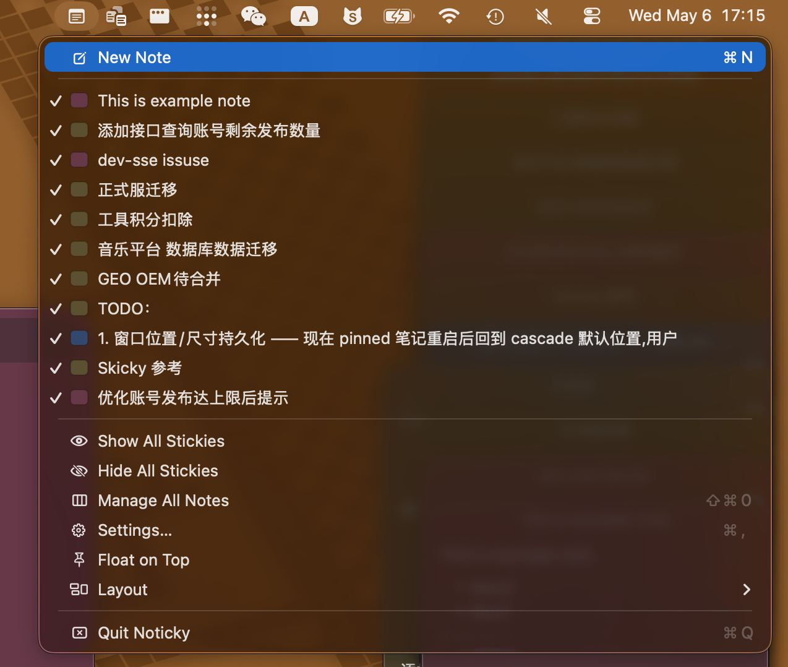
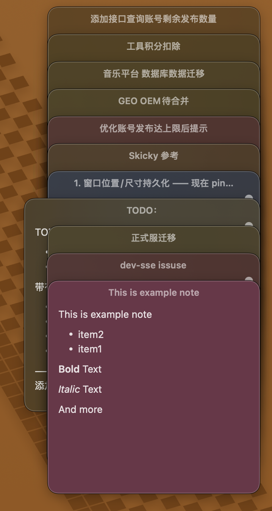
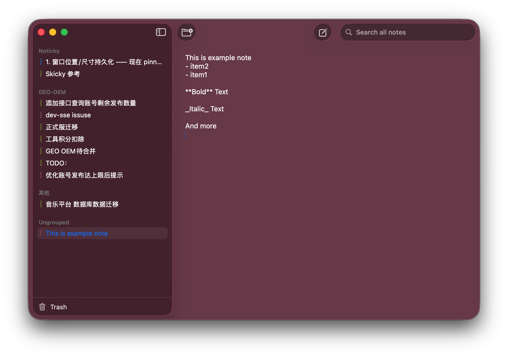

# Noticky

English · [简体中文](./README.zh-CN.md)

> Native macOS sticky notes — menubar-resident, global hotkey capture, multi-window floats, Markdown, iCloud sync.

Noticky is a native sticky-notes / quick-capture app for macOS 15+. It uses an
AppKit shell with SwiftUI content (bridged via `NSHostingController`), backed by
Core Data, with optional `NSPersistentCloudKitContainer` for cross-device sync.
No Dock icon, lives in the menu bar (`LSUIElement`).

> Screenshot placeholders — to be added later: menubar / floating note / Manager / Settings

<p align="center">
  
  
</p>
<p align="center">
  
</p>

---

## Features

### Floating sticky notes
- 6-color palette (yellow / pink / blue / green / purple / gray); the default
  color for new notes is configurable in Settings.
- Three layout modes (menubar → Layout):
  - **Free** — place anywhere
  - **Stack** — cascade; selecting a note slides it to the bottom for full visibility
  - **Tile** — auto-arranged grid; drag a note to reorder
- The `Pin` flag doubles as "auto-restore on next launch" — quitting the app
  doesn't lose your working set.
- Each note's window position / size is persisted independently
  (`Note.frameX/Y/W/H`).
- `Float on top` (menubar toggle) keeps every floating note above other windows.
- Double-click the title bar to collapse (toggleable in Settings).
- Inactive notes fade for less visual noise (toggleable in Settings).

### Editor
- Plain text (`PlainTextEditor`, an `NSTextView` wrapper) and Markdown modes.
- Markdown rendering via [gonzalezreal/Textual](https://github.com/gonzalezreal/textual),
  with one-tap toggle between rendered view and edit mode.
- Global font size (12–24, applied live to every open window).
- New notes can start in edit mode or stay rendered, your choice.

### Quick Capture (global hotkey)
- Default `⌘⇧N`, customizable in Settings → Shortcuts
  (powered by [sindresorhus/KeyboardShortcuts](https://github.com/sindresorhus/KeyboardShortcuts)).
- Three capture sources:
  - **AX + whitelist** — read the selected text from the frontmost app via the
    Accessibility API (requires permission and a non-sandboxed runtime).
  - **Clipboard only** — pre-fill with the current clipboard contents, no AX call.
  - **Disabled** — open a blank capture window.
- Whitelist is configured by bundle ID; AX is only invoked for whitelisted apps.

### Manager window
- Native `NSOutlineView` sidebar: All Notes / your custom groups / Ungrouped / Trash.
- Drag-and-drop notes into groups (multi-select drag follows the selection).
- System `.searchable` full-text search.
- Create / rename / move groups via right-click.
- Multi-select bulk operations: change color, pin/unpin, open as floating
  (capped at 8 to avoid screen clutter).

### Trash
- Deletions are soft — items go to Trash.
- On launch, items older than N days (default 30, configurable 7–365 in Settings)
  are purged for real, matching the behavior of macOS Notes / Mail.

### Import / Export / Backup
- Single-note Markdown export (`.md`), or batch-export multiple notes to a folder.
- File menu: full-database backup / restore as a single JSON file.
- Restore is **non-destructive** — it dedupes by UUID and skips notes already
  present, so it never overwrites your current data.

### iCloud sync (optional)
- Off by default. Toggle in Settings → iCloud Sync; first-time enable requires a
  restart (Core Data has no hot-swap API for the CloudKit container).
- Once enabled, runs on `NSPersistentCloudKitContainer` for live cross-Mac sync.
- Verified working with China iCloud (`gateway.icloud.com.cn`).
- Built-in DEBUG-only schema deployment helper: pushes the schema to CloudKit
  Development. Promoting Development → Production still has to happen manually
  in [CloudKit Console](https://icloud.developer.apple.com) — see
  [CLAUDE.md](./CLAUDE.md#schema--cloudkit-deployment-workflow).
- DEBUG builds also expose `Run migration self-test` to validate that
  lightweight migration handles your model changes before tagging a release.

### Localization
- Bundled English and Simplified Chinese strings; follows the system locale by
  default, can be forced in Settings → General.

### Data safety
- Lightweight Core Data migration is always on
  (`shouldInferMappingModelAutomatically`).
- On store load failure, Noticky **never silently nukes the database** — it backs
  up the sqlite + shm + wal triple to `~/Desktop/Noticky-Recovery-{ts}/`, shows a
  critical NSAlert, and quits.
- Versioned model: `Persistence/Schema/SchemaV{N}.swift` + a `CoreDataSchema`
  registry, with `SchemaVersion.current` pointing at the active version.

---

## Requirements

- macOS 15.0+
- To build: Xcode 16+, Swift 5.0+, [xcodegen](https://github.com/yonaskolb/XcodeGen)
- To release: Apple Developer account (team ID `T8F5T6HKG8`) + Developer ID certificate

---

## Project layout

```
Sources/Noticky/
├─ App/                  # Entry point (custom main), AppDelegate, MenuBarController
├─ Persistence/          # PersistenceController, Note, NoteGroup
│  └─ Schema/            # Versioned Core Data schemas
├─ Features/
│  ├─ Floating/          # Floating sticky notes (FloatingNoteWindow, StickyPalette)
│  ├─ Notes/             # Editors (PlainTextEditor, MarkdownNoteEditor)
│  ├─ Capture/           # Global-hotkey quick capture + AX/clipboard sources
│  ├─ Manager/           # Manager window (NSOutlineView sidebar)
│  ├─ Settings/          # Settings window (NSTabViewController + SwiftUI tabs)
│  └─ IO/                # Import / export / backup
└─ Resources/            # Info.plist, entitlements, AppIcon
scripts/                 # release.sh, ExportOptions.plist
project.yml              # xcodegen project definition
```

For deeper architectural context (why an AppKit shell instead of pure SwiftUI App,
why a programmatic Core Data model instead of `.xcdatamodeld`, recurring gotchas),
see [CLAUDE.md](./CLAUDE.md).

---

## Build & run (development)

```sh
# 1. Generate Noticky.xcodeproj (.xcodeproj is gitignored, regenerate after
#    pulling or after adding/moving files).
xcodegen

# 2. Debug build
xcodebuild -project Noticky.xcodeproj -scheme Noticky -configuration Debug build

# 3. Run the binary directly so we can capture stderr (helpful for menubar apps)
APP=$(find ~/Library/Developer/Xcode/DerivedData \
    -path "*Noticky*/Build/Products/Debug/Noticky.app/Contents/MacOS/Noticky" \
    | head -1)
pkill -f "Noticky.app/Contents/MacOS/Noticky" 2>/dev/null
"$APP" > /tmp/noticky.log 2>&1 &
disown

# 4. Quit cleanly (so applicationShouldTerminate runs and persists window state)
osascript -e 'tell application "Noticky" to quit'
```

`⌘R` from Xcode works too, but during development the CLI workflow is preferred —
it makes `tail /tmp/noticky.log` viable, which matters because LSUIElement apps
have flaky output in Console.app / `log show`.

---

## Packaging & release

`scripts/release.sh` is a single-shot script that does the entire chain:
archive → exportArchive (Developer ID re-sign) → notarize app → staple → build
DMG → notarize DMG → staple. Output lands in `dist/v<VERSION>/`:

```
dist/v1.0.0/
├─ Noticky.app
├─ Noticky-1.0.0.zip
└─ Noticky-1.0.0.dmg
```

The script is idempotent — re-runs are safe. Total wall time is ~5–15 minutes
(notarization queue time dominates).

### One-time setup (per machine)

1. **Developer ID Application certificate** in your keychain
   (team `T8F5T6HKG8` — Shenzhen Zhiqishidai Technology):

   ```sh
   security find-identity -v -p codesigning | grep "Developer ID Application"
   ```

   If missing: Xcode → Settings → Accounts → Manage Certificates →
   `+` → Developer ID Application, or have an Admin issue + share the `.p12`.

2. **Developer ID provisioning profile** named exactly `Noticky Developer ID`
   (`scripts/ExportOptions.plist` looks it up by name).

   Create it at https://developer.apple.com/account/resources/profiles/add:
   Distribution → Developer ID → App ID `tech.xvanturing.Noticky` →
   pick the Developer ID Application cert → name it `Noticky Developer ID` →
   Generate → Download → double-click to install.

   > Required because the entitlements include iCloud + Push Notifications,
   > which forces Xcode to demand a profile even for Developer ID direct
   > distribution.

3. **notarytool credentials** stored in your keychain. Generate an app-specific
   password at https://appleid.apple.com → Sign-In and Security →
   App-Specific Passwords:

   ```sh
   xcrun notarytool store-credentials "noticky-notary" \
     --apple-id  "<your-apple-id>" \
     --team-id   "T8F5T6HKG8" \
     --password  "<app-specific-password>"
   ```

   The script defaults to keychain profile `noticky-notary`; override with
   `NOTARY_PROFILE=foo ./scripts/release.sh`.

### Per release

```sh
./scripts/release.sh
```

After it completes:

```sh
# Mount the DMG → drag to /Applications → right-click Open the first time
open dist/v1.0.0/Noticky-1.0.0.dmg

# Sanity-check version / hotkey / Settings, then tag and push
git tag v1.0.0
git push --tags
# Then upload Noticky-1.0.0.dmg to GitHub Releases or your distribution channel.
```

### Bumping the version

The version is read from `CFBundleShortVersionString` in `project.yml`. After
editing it, re-run `xcodegen` to regenerate the Xcode project before invoking
`release.sh`.

### CloudKit schema deployment (separate flow)

⚠️ Release builds use `aps-environment=production`, so end users hit your
**Production** CloudKit environment. If a release bumps the schema (i.e.
`SchemaVersion.current` changes), you **must** push the new schema to
Production *first*, otherwise sync will silently drop the new fields.

Full procedure: [CLAUDE.md → Schema → CloudKit deployment workflow](./CLAUDE.md#schema--cloudkit-deployment-workflow).
TL;DR:

1. DEBUG build → Settings → iCloud Sync → `Run migration self-test` to verify.
2. DEBUG build → Settings → iCloud Sync → `Initialize Cloud schema (Development)`.
3. Open [CloudKit Console](https://icloud.developer.apple.com), promote the
   schema from Development → Production manually.
4. Then ship the release.

⚠️ CloudKit's Production schema is **append-only** — once a field/type is
deployed, it can never be removed. Add carefully.

---

## Acknowledgements

- [gonzalezreal/Textual](https://github.com/gonzalezreal/textual) — Markdown rendering.
- [sindresorhus/KeyboardShortcuts](https://github.com/sindresorhus/KeyboardShortcuts) —
  global hotkey recording and persistence.

---

## License

© 2026 xVanTuring.
