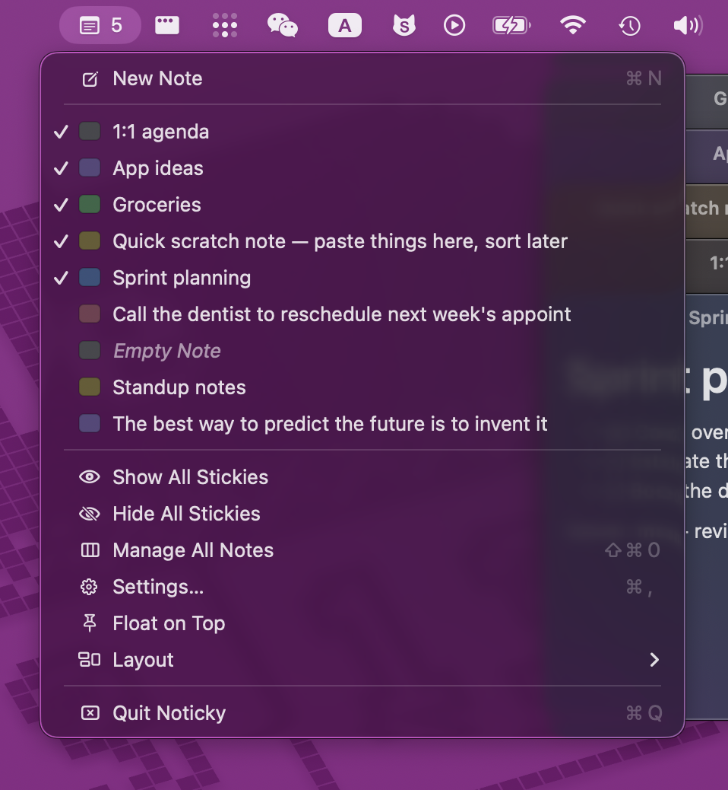
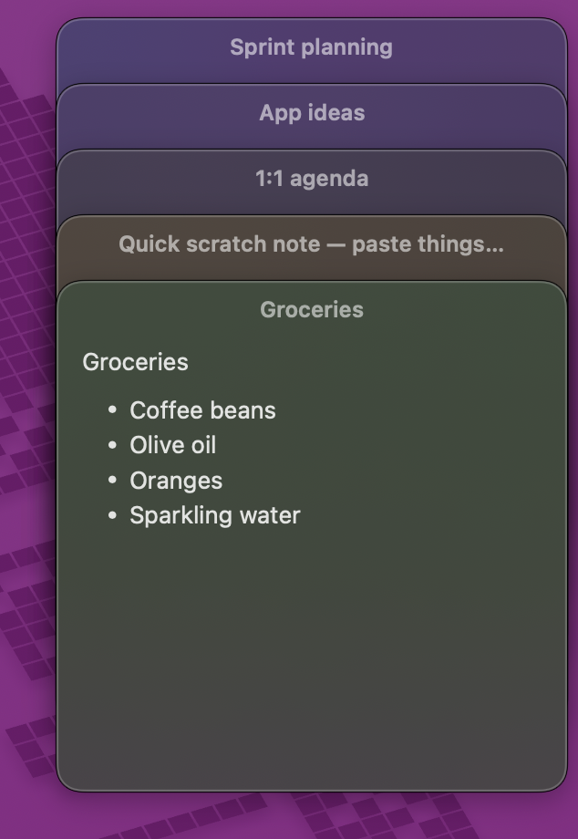
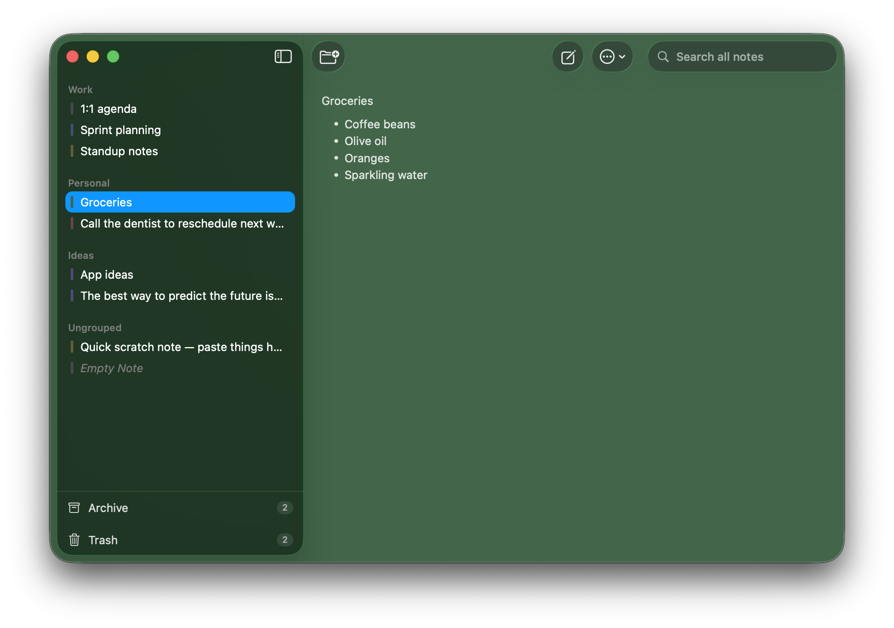
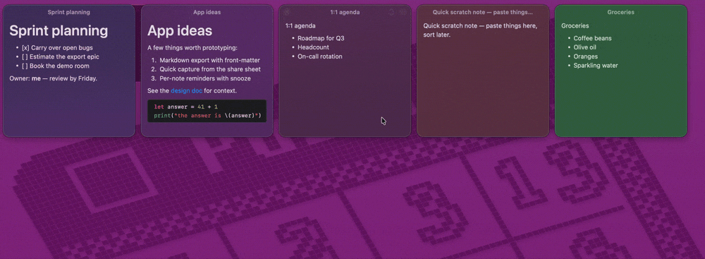

# Noticky

[English](./README.md) · 简体中文

> macOS 原生便签应用 — 菜单栏常驻、全局快捷键速记、多窗浮窗、Markdown、iCloud 同步。

Noticky 是一款 macOS 15+ 原生便签 / 速记工具。无 Dock 图标，常驻菜单栏，
不打扰你，需要时随手一记。

  
  &nbsp;&nbsp;
  

  

---

## 项目特点

### 浮窗便签
- 6 色调色板（黄 / 粉 / 蓝 / 绿 / 紫 / 灰），新便签默认色可在 Settings 配置。
- 三种排版模式（菜单栏 → Layout）：
  - **Free** 自由摆放
  - **Stack** 层叠 cascade，选中谁谁滑到最下方完整可见
  - **Tile** 平铺，拖动后按位置自动重排
- 「**Pin**」属性兼任「下次启动自动恢复」标记，关 App 不丢现场。
- 每个便签记住自己的窗口位置与尺寸。
- **Float on top**（菜单栏切换）让所有浮窗常驻最上层。
- 双击标题栏可折叠（可在 Settings 关）。
- 失焦半透明（可在 Settings 关）。

   
  <b>Stack</b> — 选中谁谁滑到最下方完整可见

   
  <b>Tile</b> — 自动平铺成网格，拖动即可重排

### 编辑器
- 纯文本和 Markdown 双模式。
- Markdown 走 [gonzalezreal/Textual](https://github.com/gonzalezreal/textual) 渲染，
  支持「渲染态 ↔ 编辑态」一键切换。
- 全局字号可调（12–24，实时同步到所有打开窗口）。
- 新建便签可选直接进编辑态或先停在渲染态。

### 全局快捷键速记（Quick Capture）
- 默认 `⌘⇧N`，可在 Settings → Shortcuts 自定义
  （基于 [sindresorhus/KeyboardShortcuts](https://github.com/sindresorhus/KeyboardShortcuts)）。
- 三种取材模式：
  - **AX + 白名单**：通过辅助功能 API 抓 frontmost App 的选中文本（需授权）。
  - **仅剪贴板**：直接把当前剪贴板内容塞进输入框。
  - **关闭**：纯空白快速记一笔。
- 白名单按 App 配置，选中文本读取仅对白名单内 App 启用。

### 中央管理窗口（Manager）
- 侧栏：All Notes / 自定义分组 / Ungrouped / Trash。
- 拖拽便签到分组（多选拖动跟随 selection）。
- 全文搜索。
- 分组重命名 / 新建 / 右键移动。
- 多选批量改色 / 批量 Pin/Unpin / 批量打开为浮窗（≤ 8 防糊屏）。

### 回收站
- 删除走软删除，进 Trash。
- 启动时自动清理超过 N 天的旧 trash（默认 30 天，Settings 可调 7–365）。
- 对齐系统 Notes / Mail 行为。

### 导入 / 导出 / 备份
- 单条 Markdown export（`.md`）或多条到目录批量 export。
- File menu 提供整库 backup / restore，单文件 JSON 格式。
- Restore 按 UUID 去重，**不覆盖**当前数据。

### iCloud 同步（可选）
- Settings → iCloud Sync 开关，默认关闭；首次开启需重启。
- 启用后跨 Mac 实时同步。
- 已验证中国区 iCloud（`gateway.icloud.com.cn`）。

### 多语言
- 内置中文 / 英文，跟随系统或在 Settings → General 强制指定。

### 数据安全
- 加载失败时**不再静默销毁** — 会把数据备份到
  `~/Desktop/Noticky-Recovery-{ts}/` 后弹出提示再退出，库损坏也不丢笔记。
- 跨版本数据迁移自动且常开。

---

## 系统要求

- macOS 15.0+

---

## 致谢

- [gonzalezreal/Textual](https://github.com/gonzalezreal/textual) — Markdown 渲染。
- [sindresorhus/KeyboardShortcuts](https://github.com/sindresorhus/KeyboardShortcuts) —
  全局快捷键的录制与持久化。

---

## 开发

构建、项目结构、打包发布与 CloudKit schema 流程见
**[DEV.zh-CN.md](./DEV.zh-CN.md)**（更深入的架构讲解见 [CLAUDE.md](./CLAUDE.md)）。

---

## License

© 2026 xVanTuring.
